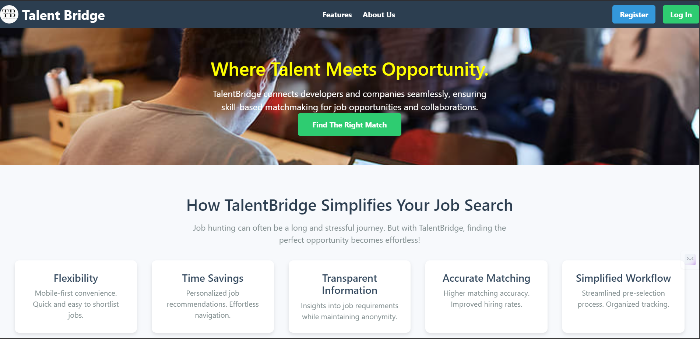
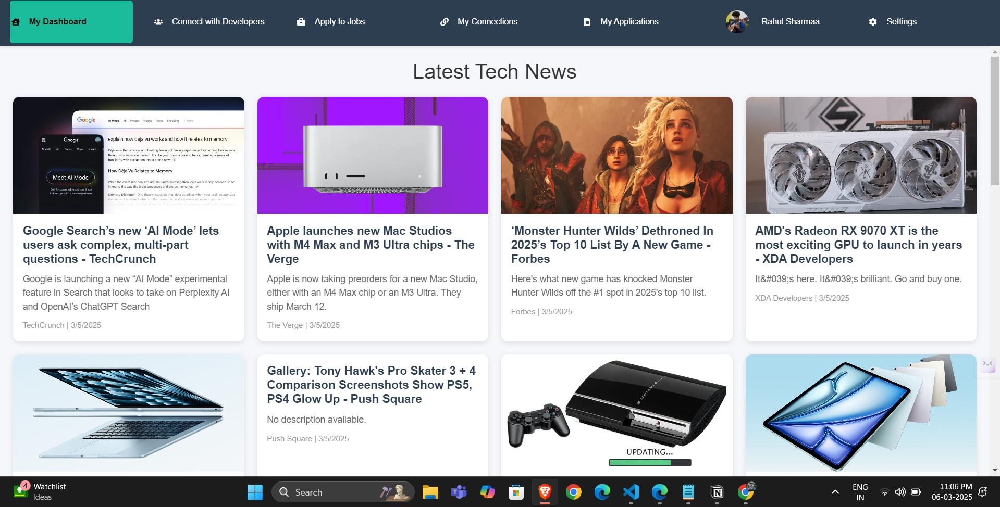
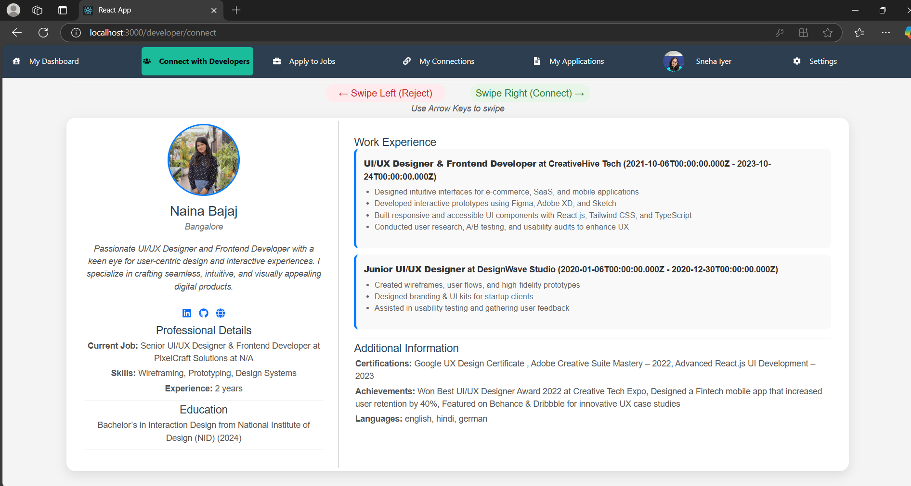
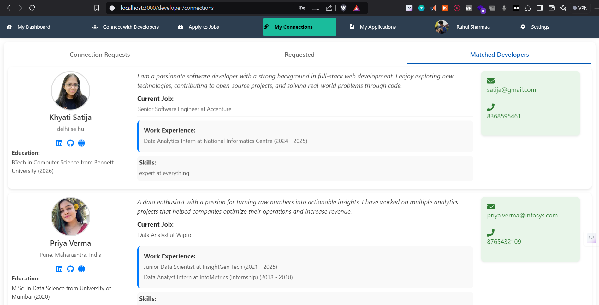
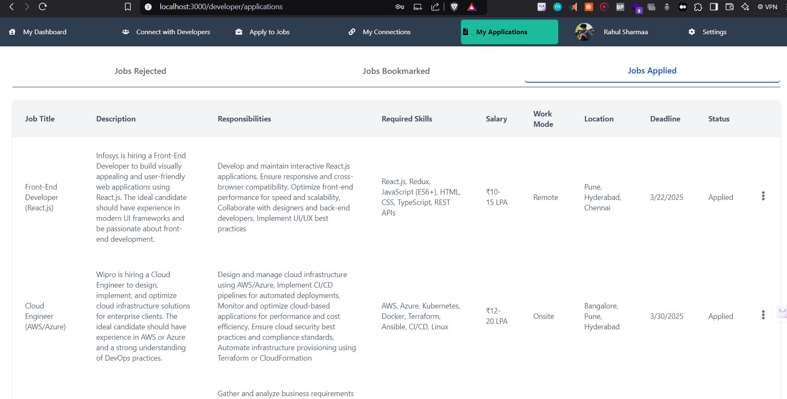
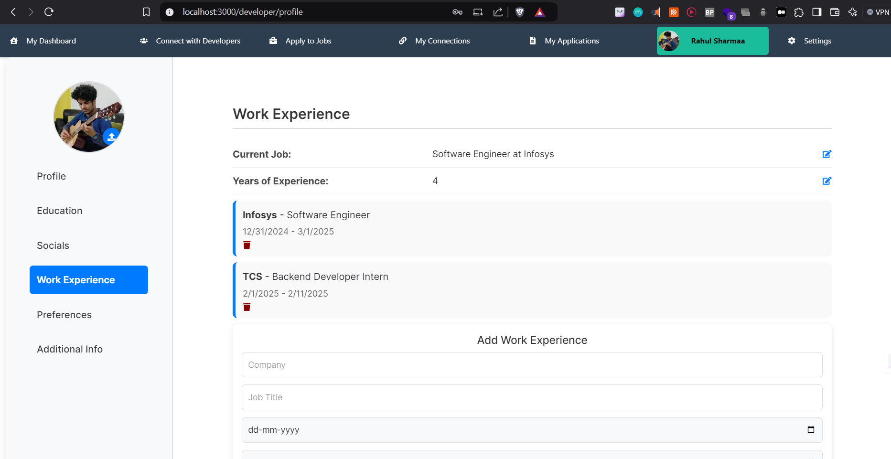
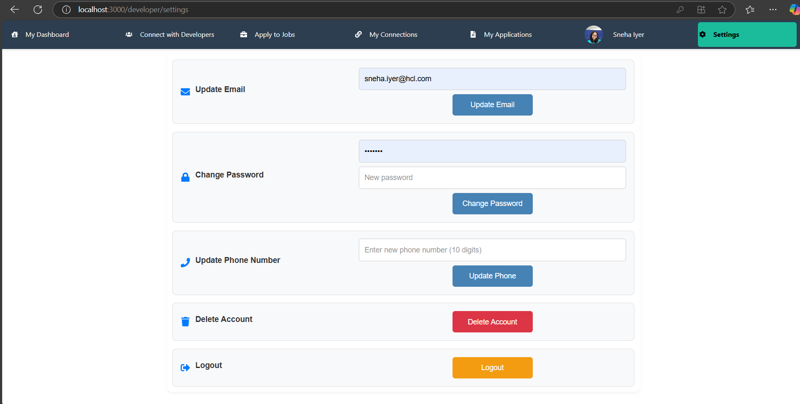
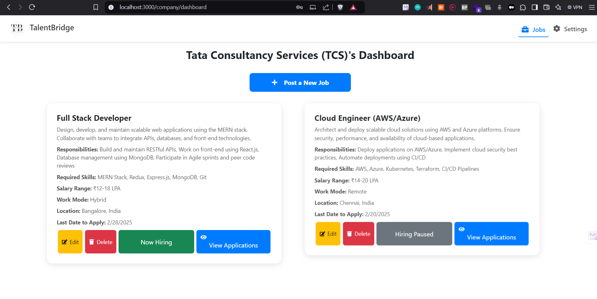
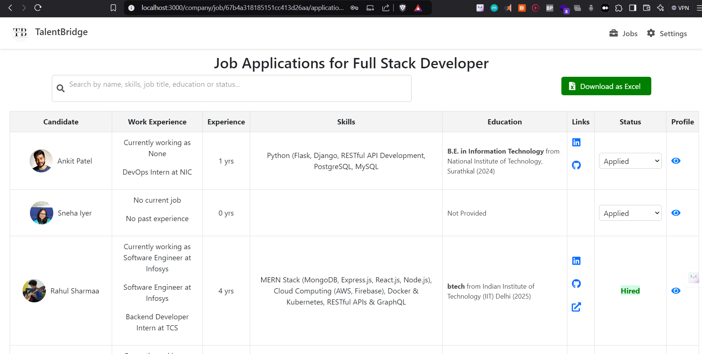

<<<<<<< HEAD
# TalentBridge-MERN-App
=======
# TalentBridge - Swipe. Match. Hire.

**TalentBridge** is a **MERN stack** web application that enables **developers** to connect with **other developers** for projects and hackathons and apply for job opportunities using a **Tinder-style swipe feature**. Similarly, **companies** can post job openings and review applicants without bias, ensuring a fair hiring process.

## 🚀 Features

### 👨‍💻 **For Developers**
- **Profile Creation**: Add professional details, skills, experience, resume, and preferences.
- **Swipe Right to Connect**: Connect with other developers for hackathons or collaborations.
- **Swipe Right to Apply**: Apply to job postings with a swipe-based interface.
- **Connections Management**: View sent/received connection requests and manage contacts.
- **Application Tracking**: Track job applications and see acceptance/rejection updates.

### 🏢 **For Companies**
- **Job Posting**: Post job opportunities with detailed descriptions and requirements.
- **Candidate Matching**: See developers whose skills match the job criteria.
- **Application Management**: Accept or reject applicants and download applicant details in an **Excel sheet**.

---

## 📸 **Screenshots**

### 🔹 **Developer Side**
1. **Home Page**  
     
2. **Developer Dashboard**  
     
3. **Swipe Cards - Developers**  
     
4. **Swipe Cards - Jobs**  
     
5. **Connections Page**  
     
6. **Applications Page**  
     
7. **Profile Page**  
     
8. **Settings Page**  
     

### 🔹 **Company Side**
1. **Company Dashboard**  
     
2. **View Applicants Page**  
     

---

## 🛠️ **Tech Stack**
### **Frontend**
- React.js
- Tailwind CSS
- Bootstrap
- React Router
- Axios

### **Backend**
- Node.js
- Express.js
- MongoDB (Mongoose)
- Bcrypt (for password hashing)
- Nodemailer (for email notifications)
- Multer (for file uploads)
- Validator (for input validation)
- Natural (for text processing -> gives relevant jobs to the developers first)
- NewsAPI (for fetching relevant developer news)

---

## 💻 **Installation & Setup**
Follow these steps to run the project locally on your machine.

### **1️⃣ Clone the Repository**
```sh
git clone https://github.com/KhyatiSatija/TalentBridge-MERN-App.git
cd talentbridge
```

### **2️⃣ Backend Setup**
```sh
cd backend
npm install
```
- Create a `.env` file inside `backend/` and configure:
  ```env
  PORT=5000
  MONGO_URI=your_mongodb_connection_string
  EMAIL_USER
  EMAIL_PWD
  NEWS_API
  ```
- Run the backend:
  ```sh
  nodemon server.js
  ```

### **3️⃣ Frontend Setup**
```sh
cd ../frontend
npm install
npm start
```

### **4️⃣ Access the Application**
- Open **`http://localhost:3000`** in your browser.

---

## 🐳 **Docker Setup**
To run the entire project using Docker:
1. Ensure you have **Docker** installed.
2. Run:
   ```sh
   docker-compose up --build
   ```
3. The application will be accessible at `http://localhost:3000`.

---

## 📜 **API Endpoints**
The company list of API endpoints is present at API_Guide.md at the root of the directory.

---

## 📜 **License**
This project is licensed under the **MIT License**.

---

## 🌟 **Show Your Support**
If you like this project, **star** this repository ⭐ on GitHub.

---
>>>>>>> 1fc2b6c (Initial commit)
